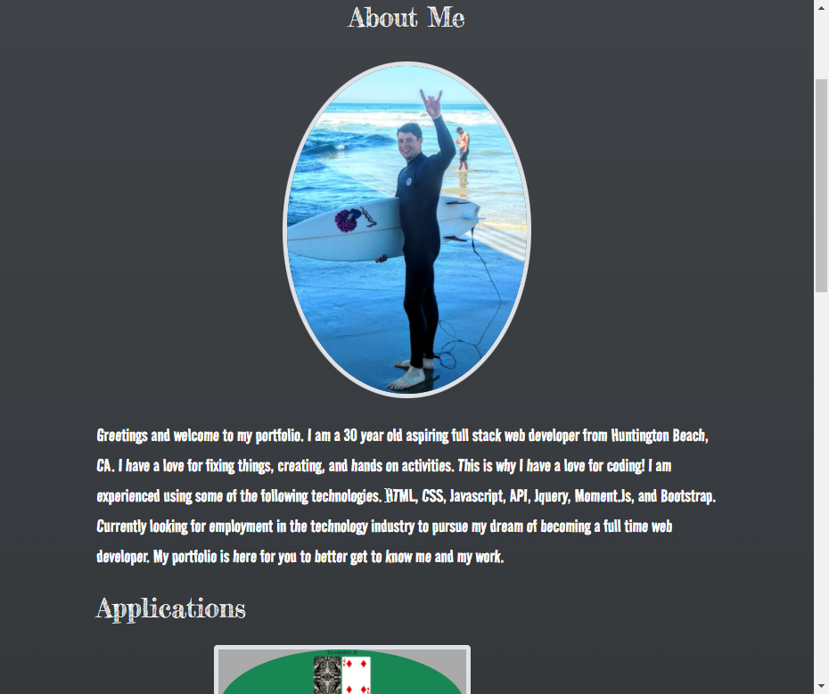

# Portfolio Readme

Welcome to the README for my Portfolio Webpage

On this webpage I will be showcasing the skills I have acquired since learning to code. I used HTML, CSS, and BootStrap on my portfolio.
I have included links that will take you to applications I have completed.
Included are links to my GitHub, LinkedIn, Resume, and contact information including my email and phone number.
I hope you enjoy my page

-Ludie F. Lambright V

[My Portfolio](https://veidul.github.io/Portfolio/)

